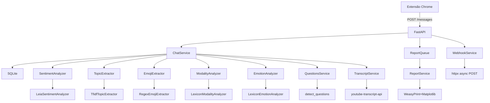

# PulsoDaLive / LiveScribe

Captura e análise de discurso em tempo real de chats de **lives do YouTube**. Coleta mensagens via extensão Chrome, analisa sentimentos, emoções, tópicos, engajamento e gera **relatórios PDF completos com gráficos**.

---

## Funcionalidades

### Captura
- Extensão Chrome (Manifest V3) com `MutationObserver` no `#chatframe` do YouTube
- Envio automático de mensagens para a API com token JWT opcional
- Suporte a múltiplas plataformas (coluna `platform`)

### Análise de Discurso (16 endpoints)
| Análise | Descrição |
|---------|-----------|
| **Frequência de palavras** | Top-N palavras ignorando stopwords em português |
| **Sentimento (LeIA)** | Positivo / Negativo / Neutro — VADER adaptado para português |
| **Timeline de sentimentos** | Evolução do sentimento em buckets de tempo |
| **Emoções (6 categorias)** | Alegria, Raiva, Medo, Surpresa, Tristeza, Nojo — léxico com ~500 palavras |
| **Modalidade discursiva** | Certeza / Dúvida / Ênfase — timeline por bucket |
| **Picos de engajamento** | Janelas deslizantes de maior atividade no chat |
| **Tópicos (TF-IDF)** | Extração de termos mais relevantes via scikit-learn |
| **Timeline de tópico** | Frequência de um termo específico ao longo do tempo |
| **Topic-Sentiment** | Cruzamento: "que sentimento as pessoas expressam ao falar do tópico X?" + emoção dominante + snippet de transcrição do YouTube |
| **Ranking de emojis** | Emojis mais usados com sentimento associado (mapa de 50 emojis) |
| **Perguntas** | Detecção de perguntas no chat + agrupamento por similaridade Jaccard |
| **Top autores** | Ranking de espectadores mais ativos + sentimento dominante |

### Exportação
- JSON, CSV e XLSX (openpyxl)
- Inclusão opcional de análise nos exports

### Relatórios PDF
- Geração **assíncrona** em background worker thread
- **Polling** de status (`POST` → `GET /{job_id}` → `GET /{job_id}/download`)
- Gráficos embutidos (matplotlib): sentimentos, emoções, modalidade e picos de engajamento
- Template responsivo para impressão A4 com 3 seções: Resumo Executivo → Análise Detalhada → Apêndice
- Inclui dados de sentimento geral, tópicos, topic-sentiment com transcrição, emojis, top autores, perguntas frequentes

### Webhooks
- CRUD completo de webhooks por usuário
- Eventos: `new_message`, `peak_engagement`
- Disparo assíncrono via `BackgroundTasks` + `httpx`

### Integração YouTube Transcript
- Transcrição automática de vídeos via `youtube-transcript-api`
- Cache LRU de 32 transcrições
- Snippet contextual (~30s) no momento do pico de cada tópico

### Autenticação
- JWT (HS256, 24h) com `python-jose` armazenado em **cookie HttpOnly** (não em localStorage)
- Registro e login local (email + senha com bcrypt) — seta cookie `access_token`
- Logout via `POST /api/auth/logout` (deleta cookie)
- Google OAuth2 (httpx-oauth) — vincula conta existente por email
- Isolamento completo de dados por `user_id`
- Rate limiting com `slowapi` (5/min em auth, 120/min em messages, 3/min em reports, 10/min em webhooks)

### Segurança
- **CORS restrito** a origins específicas (`localhost:8000`, `localhost:5173`), `allow_credentials=False`
- **XSS mitigado** — `escapeHtml()` em todos os renders do dashboard; dados de chat não injetados diretamente no DOM
- **SSRF mitigado** — validação de URL de webhook com blocklist de redes privadas (RFC 1918, loopback, link-local, CGNAT) + resolução DNS
- **Webhooks isolados por usuário** — disparo filtra por `user_id`, sem cross-user data leak
- **Relatórios isolados por usuário** — `get_status`/`get_pdf` verificam ownership do job
- **Header injection mitigado** — `urllib.parse.quote()` no `Content-Disposition` do export
- **Erros internos não vazam** — exceções 500 retornam mensagem genérica + log no servidor
- **Parâmetros com bounds** — `top_n`, `interval_minutes`, `window_minutes` com `Query(ge=1, le=...)`
- **SECRET_KEY validado** — rejeita valor padrão em produção; lido dinamicamente (não em import-time)
- **Cleanup de jobs** — relatórios concluídos há >1h são removidos automaticamente

### Dashboard
- HTML interativo com Chart.js
- Login/logout integrado
- Visualização de todas as análises e lives do usuário

---

## Stack

| Camada | Tecnologia |
|--------|-----------|
| **API** | FastAPI + Pydantic v2 |
| **ORM** | SQLAlchemy + SQLite (WAL mode) |
| **Auth** | JWT (python-jose) + bcrypt + Google OAuth2 (httpx-oauth) |
| **NLP** | LeIA (sentimento), scikit-learn (TF-IDF), léxicos próprio (emoções, modalidade) |
| **PDF** | WeasyPrint + Jinja2 + Matplotlib |
| **Extensão** | Chrome Manifest V3 (content.js + popup) |
| **Transcrição** | youtube-transcript-api |
| **Testes** | pytest + pytest-cov + httpx (129 testes) |

---

## Como Rodar

```bash
# Clone e entre na pasta
cd pulso-da-live

# Ambiente virtual
python3 -m venv venv
source venv/bin/activate

# Dependências (inclui torch para LeIA)
pip install -r requirements.txt

# Configure .env (opcional — defaults funcionam para dev)
cp .env.example .env  # se existir, ou crie manualmente

# Rode
uvicorn app.main:app --reload
```

Acesse:
- **API Docs:** http://127.0.0.1:8000/docs
- **Redoc:** http://127.0.0.1:8000/redoc
- **Dashboard:** http://127.0.0.1:8000/dashboard
- **Healthcheck:** http://127.0.0.1:8000/

---

## Extensão Chrome

1. Vá em `chrome://extensions/`, ative **"Modo do desenvolvedor"**
2. Clique em **"Carregar sem compactação"** → selecione a pasta `frontend/`
3. Clique no ícone da extensão → faça login (local ou Google)
4. Abra uma **live do YouTube** com chat ativo
5. As mensagens serão enviadas automaticamente para `http://127.0.0.1:8000/api/chat/messages`
6. O token JWT fica armazenado em `chrome.storage.local` e é enviado no header `Authorization`

---

## Endpoints

### Auth — prefixo `/api/auth`

| Método | Rota | Auth | Descrição |
|--------|------|:----:|-----------|
| `POST` | `/register` | ❌ | Cadastro local (email + senha) → seta cookie HttpOnly |
| `POST` | `/login` | ❌ | Login local → seta cookie HttpOnly |
| `POST` | `/logout` | ❌ | Deleta cookie de autenticação |
| `GET` | `/login/google` | ❌ | Redireciona para Google OAuth |
| `GET` | `/callback/google` | ❌ | Callback Google → seta cookie HttpOnly |
| `GET` | `/me` | ✅ | Dados do usuário autenticado |

### Chat — prefixo `/api/chat`

| Método | Rota | Auth | Descrição |
|--------|------|:----:|-----------|
| `POST` | `/messages` | ✅ | Salvar mensagem + disparar webhooks |
| `GET` | `/lives` | ✅ | Listar lives do usuário |
| `GET` | `/{live_id}/word-frequency` | ✅ | Top-N palavras mais frequentes |
| `GET` | `/{live_id}/sentiment` | ✅ | Resumo de sentimentos (LeIA) |
| `GET` | `/{live_id}/sentiment-timeline` | ✅ | Sentimento em buckets de tempo |
| `GET` | `/{live_id}/engagement-peaks` | ✅ | Picos de engajamento (janela deslizante) |
| `GET` | `/{live_id}/topics` | ✅ | Tópicos via TF-IDF |
| `GET` | `/{live_id}/topic-timeline` | ✅ | Frequência de um termo ao longo do tempo |
| `GET` | `/{live_id}/topic-sentiment` | ✅ | Tópico ↔ Sentimento ↔ Emoção + transcrição |
| `GET` | `/{live_id}/top-authors` | ✅ | Ranking de espectadores |
| `GET` | `/{live_id}/emojis` | ✅ | Emojis + sentimento |
| `GET` | `/{live_id}/questions` | ✅ | Perguntas detectadas + grupos Jaccard |
| `GET` | `/{live_id}/emotion-timeline` | ✅ | 6 emoções em buckets de tempo |
| `GET` | `/{live_id}/modality-timeline` | ✅ | Certeza/Dúvida/Ênfase em buckets |
| `GET` | `/{live_id}/export` | ✅ | Exportar mensagens (json / csv / xlsx) |

### Reports — prefixo `/api/reports`

| Método | Rota | Auth | Descrição |
|--------|------|:----:|-----------|
| `POST` | `/reports` | ✅ | Criar job de relatório PDF (background) → `{job_id}` |
| `GET` | `/reports/{job_id}` | ✅ | Polling de status e progresso |
| `GET` | `/reports/{job_id}/download` | ✅ | Download do PDF (quando `status: done`) |

Fluxo típico:
```
POST /api/reports?live_id=xxx  →  { job_id: "abc123", status: "pending" }
GET  /api/reports/abc123       →  { status: "processing", progress: 50 }
GET  /api/reports/abc123       →  { status: "done", progress: 100 }
GET  /api/reports/abc123/download  →  (binary PDF)
```

### Webhooks — prefixo `/api/webhooks`

| Método | Rota | Auth | Descrição |
|--------|------|:----:|-----------|
| `POST` | `/webhooks` | ✅ | Criar webhook (url + evento) |
| `GET` | `/webhooks` | ✅ | Listar webhooks do usuário |
| `DELETE` | `/webhooks/{id}` | ✅ | Deletar webhook |

---

## Arquitetura de Serviços



### Interfaces (ABCs)

| Interface | Implementação | Técnica |
|-----------|--------------|---------|
| `SentimentAnalyzer` | `LeiaSentimentAnalyzer` | LeIA (VADER adaptado pt-BR) |
| `TopicExtractor` | `TfidfTopicExtractor` | scikit-learn TfidfVectorizer |
| `EmojiExtractor` | `RegexEmojiExtractor` | regex `\p{Extended_Pictographic}` |
| `ModalityAnalyzer` | `LexiconModalityAnalyzer` | Léxico de 60+ expressões |
| `EmotionAnalyzer` | `LexiconEmotionAnalyzer` | Léxico de ~500 palavras, 6 emoções |

Todas seguem ABC — podem ser trocadas sem modificar o `ChatService` (Injeção de Dependência).

### Estrutura de Diretórios

```
app/
├── api/
│   ├── deps.py              # DI: DB, auth, analisadores, report queue
│   └── routes/
│       ├── auth.py           # 5 endpoints de autenticação
│       ├── chat.py           # 15 endpoints de análise
│       ├── reports.py        # 3 endpoints de relatório PDF
│       └── webhooks.py       # 3 endpoints de webhook
├── core/
│   ├── config.py             # Settings (pydantic-settings)
│   ├── emoji_sentiment.py    # Mapa de 50 emojis → sentimento
│   ├── emotion_lexicon.py    # Léxico de ~500 palavras (6 emoções)
│   ├── modality_lexicon.py   # Léxico de modalidade (certeza/duvida/enfase)
│   ├── stopwords.py          # Stopwords pt-BR
│   └── timezone.py           # Utilitários de timezone (BRT)
├── infrastructure/
│   └── database.py           # Engine + SessionLocal (SQLite WAL)
├── models/                   # ORM: Message, User, Webhook
├── repositories/
│   └── messages.py           # Queries de mensagens
├── schemas/                  # Pydantic: auth, chat, webhook
├── services/
│   ├── auth.py               # JWT create/verify
│   ├── chat.py               # ChatService orquestrador
│   ├── emojis.py             # RegexEmojiExtractor
│   ├── emotion.py            # LexiconEmotionAnalyzer
│   ├── export.py             # ExportService (JSON/CSV/XLSX)
│   ├── modality.py           # LexiconModalityAnalyzer
│   ├── questions.py          # Detect questions + Jaccard grouping
│   ├── report.py             # ReportService (PDF + Matplotlib)
│   ├── report_queue.py       # Background worker thread
│   ├── sentiment.py          # LeiaSentimentAnalyzer
│   ├── topics.py             # TfidfTopicExtractor
│   ├── transcript.py         # YouTube Transcript API + cache
│   └── webhook.py            # trigger_webhooks async
├── templates/
│   ├── dashboard.html        # SPA Chart.js
│   └── report_html.py        # Template Jinja2 para PDF
└── main.py                   # App factory + lifespan + CORS
```

---

## Testes

```bash
pytest -v --cov=app --cov-report=term-missing
```

**154 testes, 91%+ cobertura** — 17 arquivos de teste.

| Arquivo | Foco |
|---------|------|
| `test_routes.py` | Integração de **todos os endpoints** com `auth_client` |
| `test_services.py` | ChatService + LeIA real + platform |
| `test_auth.py` | JWT, register, login, Google OAuth, /me |
| `test_emotion.py` | LexiconEmotionAnalyzer + emotion_timeline |
| `test_modality.py` | LexiconModalityAnalyzer + modality_timeline |
| `test_questions.py` | detect_questions + agrupamento Jaccard |
| `test_report.py` | ReportQueue + ReportService + fluxo HTTP completo |
| `test_topic_sentiment.py` | topic_sentiment com e sem transcript |
| `test_transcript.py` | TranscriptService + cache + snippet |
| `test_export.py` | Export JSON/CSV/XLSX |
| `test_emojis.py` | RegexEmojiExtractor |
| `test_webhooks.py` | Webhook CRUD + trigger |
| `test_dashboard.py` | Dashboard HTML |
| `test_schemas.py` | Schemas Pydantic |
| `test_repositories.py` | CRUD mensagens |
| `test_models.py` | Modelos ORM |
| `test_deps.py` | Injeção de dependência |

---

## Migração de Banco

O SQLite é criado automaticamente em `data/app.db` com WAL mode. Colunas adicionadas em bancos legados via `ALTER TABLE` no `lifespan`:

| Tabela | Coluna | Fase |
|--------|--------|------|
| `messages` | `platform VARCHAR DEFAULT 'youtube'` | Fase 2 |
| `messages` | `user_id INTEGER REFERENCES users(id)` | Fase 3 |
| `users` | `password_hash VARCHAR` | Feature 1.5 |
| `users` | `provider VARCHAR DEFAULT 'local'` | Feature 1.5 |
| `users` | `is_active BOOLEAN DEFAULT 1` | Feature 1.5 |

Para recriar do zero: `rm data/app.db` e reiniciar o servidor.

---

## Configuração (.env)

As configurações são carregadas via `pydantic-settings` de um arquivo `.env` (opcional em dev):

```ini
SECRET_KEY=seu-segredo-aqui
ENVIRONMENT=development
GOOGLE_CLIENT_ID=seu-client-id
GOOGLE_CLIENT_SECRET=seu-client-secret
TIMEZONE=America/Sao_Paulo
```

Em produção, `SECRET_KEY` **obrigatório** ser alterado — o validador do `Settings` rejeita o valor padrão `"change-me-in-production"` quando `ENVIRONMENT=production`.

---

## Histórico de Features

| Marcos | Novidades |
|--------|-----------|
| **Fase 1** | Migração Pydantic v2, lifespan, type hints modernos, 28 testes |
| **Fase 2** | platform, sentiment-timeline, engagement-peaks, topics, dashboard Chart.js |
| **Fase 3** | Auth JWT, Google OAuth2, multi-usuário, filtro por user_id |
| **Feature 1.5** | Login local email/senha + bcrypt |
| **Feature 2** | Proteção de rotas + extensão Chrome com auth |
| **Feature 3** | Export JSON/CSV/XLSX |
| **Feature 4** | Sistema de webhooks (new_message, peak_engagement) |
| **Feature 5** | Análise de emoções (6 categorias, léxico ~500 palavras) |
| **Feature 6** | Análise de modalidade discursiva (certeza/duvida/enfase) |
| **Feature 7** | Detecção de perguntas + agrupamento por similaridade Jaccard |
| **Feature 8** | Transcrição YouTube + topic-sentiment enriquecido |
| **Feature 9** | Relatórios PDF com gráficos (background worker + polling) |

---

Licença: MIT
